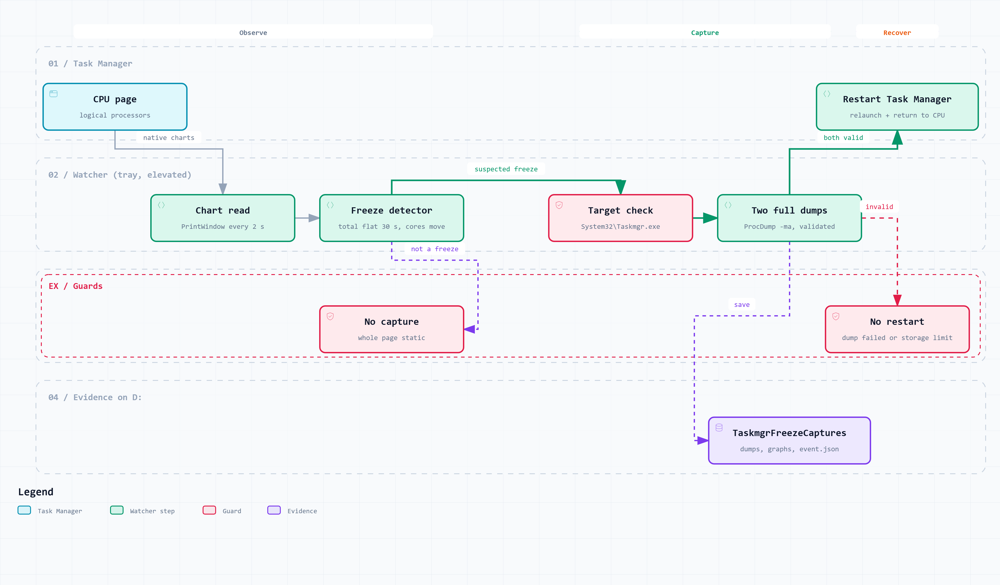
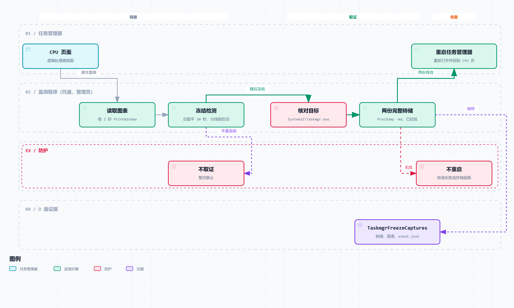

The English version governs.

**English** · [中文](#zh)

English is the controlling version.

The English version governs.

# Task Manager automatic freeze capture

💡 Vote on Feedback Hub: If you are affected by this bug, please upvote the official report so it gets escalated faster: [aka.ms/AA13rk15](https://aka.ms/AA13rk15).

Personal Windows diagnostic extension of [ScreenWatcher](https://github.com/bigzeze/ScreenWatcher), based on commit `e10fcd2`. The original MIT license, source and icon attribution are retained. The automatic native chart capture, detector and dump workflow were added with Codex as an AI collaborator.
The original upstream README is kept unchanged as [`UPSTREAM-README.md`](UPSTREAM-README.md).

<picture>
  <source media="(prefers-color-scheme: dark)" srcset="docs/diagrams/overview.en.dark.png">
  
</picture>

## Operation

- `Install.cmd`: one administrator approval installs the `TaskmgrFlatlineWatch` scheduled task, starts it immediately, and starts it automatically 15 seconds after this user logs in.
- `Start.cmd`: run manually with administrator approval, without installing a scheduled task.
- The tray menu provides status and exit. Closing the status window hides it; it does not stop monitoring.
- Logon autostart switch: the **Start at logon** item in the tray menu and the checkbox in the status window, or `Autostart.cmd on|off|status` (asks for administrator approval to change). It only enables or disables the registered task; the running watcher keeps running, and `Start.cmd` still works when autostart is off. Autostart was switched off on 2026-10-04.
- Restart-only mode: **Restart only, no evidence** in the tray menu or the status window (saved across restarts). After the same 30-second confirmation, Task Manager is restarted directly: no graph PNGs, no dumps, and no origin monitor; attached debuggers are detached gracefully when the mode is switched on. Each restart leaves only `restart-YYYYMMDD-HHMMSS-ffffff\event.json` on D: (time, PID, restart result). A failed restart is retried as before, and the same-window cooldown is 60 seconds instead of ten minutes.
- `Stop.ps1`: stop this running watcher gracefully. `Uninstall-Autostart.ps1`: remove only this installation's scheduled task and stop the watcher. Evidence is retained.
- For a fresh checkout, install Python 3.12 and run `Setup.cmd`. Dependencies are pinned in `requirements-flatline.txt`. Setup downloads Microsoft's signed ProcDump from the official Sysinternals site and checks its signature. ProcDump is not redistributed in Git.

## Automatic detection

Update 2026-10-01: the ten-minute cooldown now applies only to repeated captures of the same PID and window. A replacement Task Manager that freezes again receives a new dump pair and recovery after the 30-second visual confirmation, without waiting for the previous process's cooldown. A blocked capture shows the cooldown and remaining seconds. Fourteen tests pass, including replacement-process recovery eligibility and cooldown persistence across watcher restarts.

Every two seconds a separate helper enumerates Task Manager's native `CvChartWindow` controls. It identifies the leftmost top CPU thumbnail and a complete logical-processor graph grid matching the machine's logical processor count. `PrintWindow` reads those controls directly; no manual region selection, OCR, screenshot of other applications, or upload is involved. Read operations time out after eight seconds by terminating only our own helper.

The newest 20% of the aggregate curve must remain horizontal at the same pixel height for 30 seconds, while logical graphs continue changing. The detector uses a one-pixel tolerance. It reports a **suspected** freeze: genuinely constant total load can also satisfy this visual test. A static entire page does not trigger a dump. Ten seconds of changing aggregate curves rearm detection. A ten-minute capture cooldown also applies.

Task Manager must be running on **Performance → CPU → Logical processors**, with its chart controls rendered. Covered windows can be captured directly; minimized windows, another page, or a closed Task Manager cause the watcher to wait. After two fault dumps pass validation, it closes only the captured Task Manager (with a targeted termination fallback if closing times out), relaunches it and uses bounded UI Automation in an STA PowerShell process to return to Performance / CPU. It verifies the logical graph grid before reporting recovery. Windows itself is never restarted. Ordinary installation verification does not restart Task Manager; an explicitly requested recovery verification exercises that path separately. Display layout changes are rediscovered automatically. The current color detector recognizes blue/cyan CPU plots; unsupported contrast themes can be reported as unrecognized.

## Evidence on D:

All evidence stays in `D:\TaskmgrFreezeCaptures\YYYYMMDD-HHMMSS-ffffff`:

- Two full Task Manager dumps, using `procdump64 -r -ma`, with five seconds between completion of the first and starting the second.
- Aggregate and logical graph PNGs from the in-memory history, at up to three time points.
- `event.json`: detector measurements, timestamps, PID, rectangles and actual dump success/failure.
- ProcDump output logs. `D:\TaskmgrFreezeCaptures\status.json` records current watcher state; its timestamp matters if the process has stopped.

The target executable is verified as Windows `System32\Taskmgr.exe` before each dump. The original window identity is also checked. Dump failures are recorded, not presented as successful captures. No Defender setting, driver, CPU setting or performance counter configuration is changed.

New dumps pause if D: has less than 10 GiB free or existing dumps exceed 50 GiB. One active capture can exceed that soft limit. Existing evidence is never automatically deleted. The history ring holds only 31 pairs of graph images; it does not record the desktop continuously. Exiting during an active dump allows the current capture thread to finish.

## Origin monitor and query trace

Each Task Manager instance gets one debugger. By default ProcDump waits for the first `0x8007139F` aggregation report and writes one full dump to `origin-YYYYMMDD-HHMMSS-PID`. It is detached with `procdump -cancel`, never terminated.

`Start.cmd --query-trace` replaces ProcDump with cdb (WinDbg) for each instance, in `origin-…-PID-trace`. Logging breakpoints in `QueryProcessInformation` record every NtQSI status and buffer length, flag queries whose three attempts all failed but still returned success, and walk the last record of each such buffer. At the first `0x8007139F` report it writes `Taskmgr-origin.dmp` and detaches. `query-trace.jsonl` lists third-call successes, exhausted retries and other errors, and `origin.json` holds the counts. The offsets are valid only for `TaskManagerDataLayer.dll` with SHA-256 `829263f5…5dce`. A different file hash, or different code in memory, means no breakpoint is set and ProcDump is used instead. The breakpoints widen the gap between NtQSI calls, so counts are not natural failure rates. Detach clears breakpoints, resumes for one second, then quits with `qd`. Detaching directly with breakpoints set killed a test process with `0x80000003`. The status window shows **Query trace** while this mode is on.

## Address provenance capture (opt-in)

`tools/capture-address-chain.py --pid <current PID> --minutes 20 --output D:/TaskmgrFreezeCaptures/address-chain-<unique name>` runs with `.venv/Scripts/python.exe` in an administrator terminal. The output folder must be new and contain no spaces. It verifies the Taskmgr image, process creation time, DLL hash and breakpoint instructions, stops the existing watcher through `Stop.ps1`, and restores its previous mode only after the debugger has exited and detached. It refuses to stop an active dump. No saved preference, autostart or system setting is changed. Creating `stop.request` inside that capture folder requests an early graceful detach.

An exhausted query receives an instance-specific query ID and a saved raw buffer. Only then are sparse address-conditioned breakpoints enabled: `ConvertFrom`, native copy/move/assignment entry and return, destructor/default construction, buffer disposal, cache swaps, vector publication and the exact Idle conflict branch at RVA `0x3E5CF`. The collector records completed source-to-destination operations and retires destroyed or overwritten addresses; equal PID/CreateTime fields alone never establish provenance. Unknown paths, malformed memory or exhausted bounds end that attempt as incomplete. Detailed tracing is limited to 120 seconds, 32 live tracked objects and 4,096 events; raw buffers to 8 MiB and the cdb log to 50 MiB. The overall capture defaults to 20 minutes (maximum 60).

At the precise conflict it saves a full dump and detaches using the existing two-stage handshake. The chart detector starts a fresh observation window after detach. A subsequent 30-second flat total graph with moving logical graphs saves PNGs and another dump. The original watcher is then restored, including after an incomplete attempt; an attached debugger prevents that restoration. This diagnostic temporarily suspends automatic recovery and changes timing. Captured counts are not natural failure rates.

Run `tools/audit-address-chain.py <capture folder>` with Python to rebuild the address lineage from operations and lifetimes, check raw-buffer hashes and the conflict dump, and write `audit.json` and `address-chain.tsv`. `address-events.jsonl`, `query-trace.jsonl`, `cdb.log`, generated scripts and the binary buffers are the retained raw evidence. A successful address audit does not itself prove the update task stopped: independently inspect the conflict and post-freeze dumps. The tool deliberately keeps overall acceptance incomplete until that separate investigation is documented. Historical report packages are not changed automatically.

### Process and thread correlation

Data loss or circular overwrite risk suppresses named candidate output. Failed session stop is retried three times; if all fail, stop only the session named in `process-trace/session.json` with `logman stop <saved session name> -ets` from an administrator terminal.

Add `--process-events` to the address-capture command to record process/thread creation and exit with the inbox Microsoft `logman` and `tracerpt` tools. This creates a uniquely named temporary ETW session, records an initial process-path/parent/creation-time snapshot, and stops only its own session. It does not collect command lines or change system logging settings. The circular ETL is limited to 64 MiB; offline XML decoding is limited to 90 seconds and 256 MiB. Raw ETL, scripts, logs and session ownership are retained in `process-trace/`. If cleanup fails, `capture.json` records the error and whether that named session may still be active.

Run `tools/correlate-process-trace.py <capture folder>` after collection. `process-candidates.tsv` lists process identities, paths, parent PIDs and process/thread changes around each abnormal query; `process-correlation.json` retains matching events and data-loss checks. PID reuse is separated by creation time and observed lifetime; unavailable identities stay unresolved. ETW events and query receipts use raw QueryPerformanceCounter ticks, avoiding rendered-timezone ambiguity. Query timestamps are debugger-host receipt times, with no measured latency bound. The default 100 ms margin (adjustable with `--margin-ms`, 0–1000) is only a search heuristic; rows distinguish events inside the receipt window from margin-only events. These are temporal candidates, not proved buffer contributors or responsible applications. Repeated controlled comparisons and the same-incident address chain are still required. Lost events, circular overwrite risk, decode errors and missing coverage are reported explicitly.

## Validation and limitations

Run `tools\ci-local.ps1` for detector tests and syntax checks. Twelve tests pass, covering moving curves, whole-page freezing, flat aggregate with moving cores, changing flat levels, capture gaps, invalid images, rearming, rejecting non-Taskmgr targets, capture orchestration with a mocked dump writer, and restart guards for failed/missing dumps and ordinary installation verification. The mocked test does not validate actual memory dumping. Native capture was exercised against this machine's Windows 11 Task Manager and its 32 charts. Administrator installation completed on 2026-09-29. The scheduled task is running with highest privileges and a 15-second user-logon trigger. Two real full-memory dumps (617,323,753 and 617,434,233 bytes) were written automatically during an explicitly labeled installation verification in `D:\TaskmgrFreezeCaptures\verification-20260929-221333-404379`. Their stream directories and full-memory payload bounds were validated. ProcDump 12.01 returned 1 with successful completion logs; the watcher now requires both a completion log and valid dump structure rather than assuming exit code zero. The earlier verification and its initially incorrect failure status are retained with independent validation results. The installation verification bypassed the freeze predicate. The first real automatic freeze capture completed on 2026-09-30 at 12:11 BST, in `D:\TaskmgrFreezeCaptures\20260930-121116-389740`, with two valid full dumps (655,868,739 and 657,822,657 bytes). Recovery was added after this event; that original PID had already exited before the update, so it was not restarted using the old evidence. On 2026-09-30, the complete recovery verification `verification-20260930-122010-037103` saved two validated dumps, gracefully restarted Task Manager from PID 9804 to 95956, restored the CPU logical-processor page, and resumed normal sampling of all 32 charts. The logon configuration was inspected and the scheduled task started successfully, but no reboot/logon test has been performed. This detector records evidence; it does not establish or fix the underlying Windows bug.

Sources: [Microsoft ProcDump documentation](https://learn.microsoft.com/en-us/sysinternals/downloads/procdump), [Microsoft PrintWindow documentation](https://learn.microsoft.com/en-us/windows/win32/api/winuser/nf-winuser-printwindow). Python dependencies retain their own licenses; the installed distributions contain their license texts.

---

[English](#en) · **中文**

以英文为准。

# 任务管理器自动冻结取证

💡 反馈中心投票：如果你也遇到了该问题，请在 Windows 反馈中心点赞支持以加快官方排期修复：[aka.ms/AA13rk15](https://aka.ms/AA13rk15)。

这是个人 Windows 诊断工具，基于 [ScreenWatcher](https://github.com/bigzeze/ScreenWatcher) 的 `e10fcd2` 提交扩展。保留上游 MIT 许可、源码和图标归属。原生图表自动抓取、异常判定和转储流程由 Codex 作为 AI 协作贡献者参与实现。
上游原 README 原样保留为 [`UPSTREAM-README.md`](UPSTREAM-README.md)。

<picture>
  <source media="(prefers-color-scheme: dark)" srcset="docs/diagrams/overview.zh.dark.png">
  
</picture>

## 使用

- `Install.cmd`：允许一次管理员提示，安装 `TaskmgrFlatlineWatch` 计划任务并立即运行；以后此用户登录 15 秒后自动启动。
- `Start.cmd`：通过管理员提示手动运行，不安装计划任务。
- 托盘菜单可以查看状态或退出。关闭状态窗口只是隐藏，不会停止监测。
- 开机自启动开关：托盘菜单的「开机自启动」项和状态窗口里的勾选框，或 `Autostart.cmd on|off|status`（修改时需管理员确认）。只启用或禁用已注册的任务；正在运行的监测不受影响，关闭自启动后仍可用 `Start.cmd` 手动启动。2026-10-04 已关闭自启动。
- 只重启模式：托盘菜单或状态窗口里的「只重启，不取证」（重启监测后仍保留）。同样确认 30 秒后，直接重启任务管理器：不存图表 PNG、不写转储、不挂首报监测；打开此模式时已挂上的调试器会正常分离。每次重启只在 D 盘留下 `restart-YYYYMMDD-HHMMSS-ffffff\event.json`（时间、PID、重启结果）。重启失败照旧重试，同一窗口的冷却从十分钟缩短为 60 秒。
- `Stop.ps1`：正常停止当前监测。`Uninstall-Autostart.ps1`：只移除此安装的计划任务并停止监测，保留已有证据。
- 全新检出时先安装 Python 3.12，再运行 `Setup.cmd`。依赖版本固定在 `requirements-flatline.txt`。安装会从微软 Sysinternals 官网下载 ProcDump 并校验微软数字签名；Git 不分发 ProcDump 二进制文件。

## 自动检测

2026-10-01 更新（取代下方保留的旧行为和验证记录）：十分钟冷却仅限制同一 PID、同一窗口的重复取证。重启后的新任务管理器再次冻结，视觉确认 30 秒后立即重新转储；两份完整转储校验成功后自动关闭并重启该任务管理器，恢复 CPU 逻辑处理器页面，不重启 Windows。受冷却限制时显示冷却状态和剩余秒数。十四项测试通过，包括新实例不受旧实例冷却阻挡，以及监测器重启后同一实例仍受冷却约束。管理员安装、完整转储与自动恢复已于 2026-09-29 至 30 日实测，尚未做系统重启或重新登录实测。本轮实时更新验收另记于项目本地调查笔记。

独立辅助进程每两秒枚举任务管理器的原生 `CvChartWindow` 控件，自动识别左侧顶部的 CPU 缩略图，以及数量与本机逻辑处理器一致的完整分线程图阵列。通过 `PrintWindow` 直接读取控件，无需手动框选、OCR、其他应用截图或上传。读取超过八秒，只终止本软件自己的辅助进程并恢复采集。

CPU 总图最新的右侧 20% 必须连续 30 秒保持同一高度的水平线，同时分线程图仍变化，允许一像素误差。这只能判为**疑似冻结**：真实负载总量恒定也可能满足视觉条件。整页静止不会触发转储。总图连续变化十秒后重新允许触发；每次取证之间还设有十分钟冷却。

任务管理器须运行在 **性能 → CPU → 逻辑处理器** 页面，图表控件处于绘制状态。被其他窗口遮挡时可直接读取；最小化、切到其他页面或关闭任务管理器时等待。本工具不会打开、切页、还原、重启或终止任务管理器。窗口布局变化后自动重新定位。当前颜色检测支持蓝色、青色 CPU 曲线；不支持的高对比度主题可能显示无法识别。

## D 盘证据

全部证据保存在 `D:\TaskmgrFreezeCaptures\YYYYMMDD-HHMMSS-ffffff`：

- 两份任务管理器全内存转储，使用 `procdump64 -r -ma`；第一份完成后间隔五秒再开始第二份。
- 内存历史中最多三个时间点的总图和分线程图 PNG。
- `event.json`：检测数值、时间、PID、控件区域和转储的实际成功或失败状态。
- ProcDump 输出日志。`D:\TaskmgrFreezeCaptures\status.json` 记录监测状态；程序退出后需注意其更新时间。

每次转储前核实目标程序为 Windows `System32\Taskmgr.exe`，并核对原始窗口身份。转储失败会明确记录，不当成成功。本软件不修改 Defender、驱动、CPU 设置或性能计数器配置。

D 盘剩余不足 10 GiB，或已有转储超过 50 GiB 时，暂停新增转储；正在进行的一次取证可能超过此软限额。不会自动删除旧证据。内存仅保留 31 组局部图表，不连续记录桌面。在转储期间退出，会允许当前取证线程完成。

## 聚合错误首报监测与查询追踪

每个任务管理器实例只挂一个调试器。默认由 ProcDump 等待第一条 `0x8007139F` 聚合错误报告，向 `origin-YYYYMMDD-HHMMSS-PID` 写一份完整转储，用 `procdump -cancel` 脱离，绝不强杀。

`Start.cmd --query-trace` 改用 cdb（WinDbg）代替 ProcDump，目录为 `origin-…-PID-trace`。在 `QueryProcessInformation` 中设只记录的断点，记下每次 NtQSI 返回状态和缓冲区长度，标记三次尝试全部失败却仍返回成功的查询，并遍历这类缓冲区的最后一条记录。遇到第一条 `0x8007139F` 报告时写出 `Taskmgr-origin.dmp` 并脱离。`query-trace.jsonl` 列出第三次成功、重试耗尽和其他错误，`origin.json` 保存计数。偏移只适用于 SHA-256 为 `829263f5…5dce` 的 `TaskManagerDataLayer.dll`；文件哈希不同或内存中代码不符时不设断点，改用 ProcDump。断点会拉长 NtQSI 调用间隔，计数不代表自然故障率。脱离时先清除断点、继续运行一秒，再用 `qd` 退出；在断点仍在时直接脱离，曾让测试进程以 `0x80000003` 退出。此模式运行时状态窗口显示「查询追踪」。

## 地址来源采集（可选）

在管理员终端用 `.venv/Scripts/python.exe` 运行 `tools/capture-address-chain.py --pid <当前 PID> --minutes 20 --output D:/TaskmgrFreezeCaptures/address-chain-<唯一名称>`。输出目录必须是新目录且不含空格。程序核对 Taskmgr 路径、进程创建时间、DLL 哈希和断点指令，通过 `Stop.ps1` 正常停止原监测器，仅在调试器退出并分离后恢复原模式；正在转储时拒绝停止。不改变保存的偏好、自启动或系统设置。在本次采集目录创建 `stop.request` 可请求提前正常分离。

重试耗尽的查询获得包含实例身份的唯一编号，并保存原始缓冲区。此后才启用按地址筛选的断点：`ConvertFrom`、原生复制／移动／赋值的入口和返回、析构／默认构造、缓冲区释放、缓存交换、向量发布，以及 RVA `0x3E5CF` 的精确 Idle 冲突分支。采集器记录已完成的源到目标操作，并淘汰已析构或覆盖的地址；相同 PID/CreateTime 字段本身不构成来源证明。未知路径、异常内存或超出边界均记为本次未完成。密集跟踪上限为 120 秒、32 个存活跟踪对象和 4,096 个事件；原始缓冲区上限 8 MiB，cdb 日志上限 50 MiB。整体默认采集 20 分钟，最多 60 分钟。

命中精确冲突后保存完整转储，通过已有的两阶段握手分离。图表检测器在分离后重新开始观察；总图平直持续 30 秒且逻辑处理器图仍变化时，保存 PNG 和另一份转储。最后恢复原监测器，未完成的尝试也会恢复；调试器仍附加时禁止恢复。这种诊断会暂时暂停自动恢复并影响时序，采集计数不代表自然故障率。

用 Python 运行 `tools/audit-address-chain.py <采集目录>`，根据操作及生命周期重建地址来源，核对原始缓冲区哈希与冲突转储，生成 `audit.json` 和 `address-chain.tsv`。`address-events.jsonl`、`query-trace.jsonl`、`cdb.log`、生成的脚本和二进制缓冲区保留为原始证据。地址核对通过本身不能证明更新任务已停止，还须独立检查冲突及冻结后转储；工具会把整体验收保持为未完成，直到另行记录该调查结果。不会自动改写历史报告包。

### 进程与线程关联

出现数据丢失或循环覆盖风险时，不输出具名候选。停止会话失败会重试至三次；若全部失败，应在管理员终端按英文部分命令，仅停止 `process-trace/session.json` 中记录的本任务会话。

在地址采集命令后加 `--process-events`，使用微软自带的 `logman` 和 `tracerpt` 记录进程／线程创建、退出事件。它创建唯一命名的临时 ETW 会话，保存初始进程路径、父进程和创建时间快照，仅停止自己创建的会话。不采集命令行，也不修改系统日志设置。循环 ETL 上限 64 MiB；离线 XML 解码上限为 90 秒、256 MiB。原始 ETL、脚本、日志及会话归属保存到 `process-trace/`；若清理失败，`capture.json` 会记录错误及该命名会话是否可能仍在运行。

采集后运行 `tools/correlate-process-trace.py <采集目录>`。`process-candidates.tsv` 列出每次异常查询附近的进程实例、路径、父 PID 及进程／线程变化；`process-correlation.json` 保留匹配事件和数据丢失检查。按创建时间和观测生命周期区分 PID 复用，无法确认的身份保留为未知。ETW 事件与查询接收时间均使用原始 QueryPerformanceCounter 计数，避开格式化时区歧义。查询时间是调试器宿主收到标记的时间，没有测得延迟上界。默认向两侧扩展 100 毫秒（可用 `--margin-ms` 设置为 0–1000），仅用于搜索；表格区分接收窗口内和仅落在扩展区的事件。这些只是时间关联候选，不能证明缓冲区增长贡献或应用责任，仍需重复对照实验与同次故障的完整地址链。丢事件、循环覆盖风险、解码错误和覆盖缺口都会明确报告。

## 验证与限制

运行 `tools\ci-local.ps1` 执行检测测试和语法检查。九项测试通过，覆盖正常波动、整页静止、总图平直但分线程变化、水平线高度变化、采样中断、无效图像、恢复后再次触发、拒绝非 Taskmgr 目标，以及使用模拟转储函数的完整取证调用流程。模拟测试不代表真实内存转储已经验证。已在本机 Windows 11 任务管理器的 32 个图表上验证原生读取。完整自动转储和登录启动需管理员安装后实测；首次启动尝试在 Windows 提权提示处被取消。尚未执行重启验证。本工具用于保留证据，不代表已确定或修复 Windows 故障根因。

来源：[微软 ProcDump 文档](https://learn.microsoft.com/en-us/sysinternals/downloads/procdump)、[微软 PrintWindow 文档](https://learn.microsoft.com/en-us/windows/win32/api/winuser/nf-winuser-printwindow)。Python 依赖保留各自许可，安装后的发行包包含许可原文。
